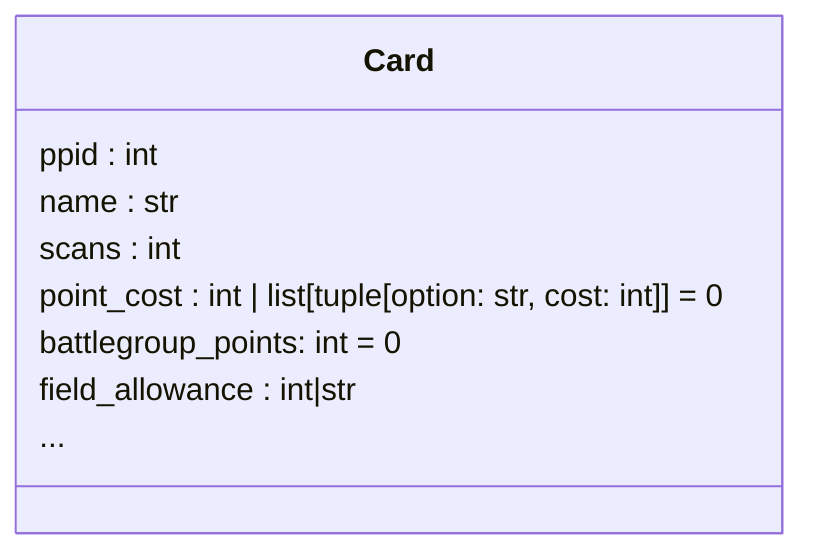
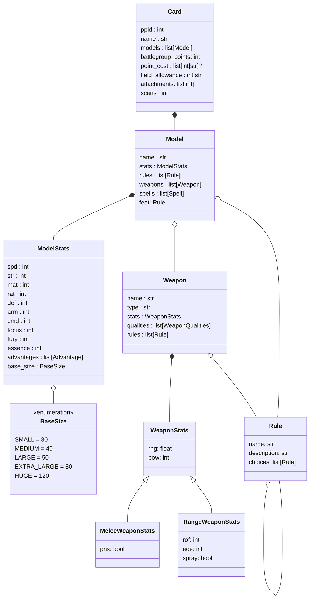

# Cards & Models

Out of all the game's concepts, the abstraction of cards and models has been the hardest
one to come up with so far as we use the word models in different contexts.

In general, models needs two things to be functional in the game:

1. A phisical representation, which are the miniatures we put our sweat, blood, and 
tears to assemble, paint, and later destroy during one of our attempts to play a game.

2. A card with rules, which describes the set of things a model can or cannot do.

Figure 1: Crucible Guard Mechanik

The Crucible Guard Mechanik, shown in Figure 1, has one miniature and one card, considering front and back, to represent the model in the game. This one-to-one
relationship is quite easy to understand and to word out as we are always in the
singuar: the model, the card.

Things start to get complicated when we move to a Warcaster:

Figure 2: Aurum Adeptus Syvestro

In Syvestro 1's case, shown in Figure 2, we have one model with two cards. We could
then say that models can have one or more cards, creating a one-to-many relationship.

Figure 3: Dragon's Breath Rocket

But then we hit cases where multiple models are described in the same card, which is the
case of the Dragon's Breath Rocked shown on Figure 3. Now we have a single card, which
represents multiple models with different stats, weapons and rules.

Figure 4: Marshal General Baldwin Gearhart & Mr. Clogg

In our last example, we have cases where two different models have their own cards, but
are only allowed in the game as a bundle, which is the case of Gearhart 1 and Clogg 1 that is composed of Gearhart himself and his assistant Mr Clogg, shown in Figure 4.
They have separate cards, but they only make sense together, as they share the same name
from the [card database][1] and the same cost, or in this
case the warjack points.

In the end, we decided to have the **Card** being the thing that
contains **Model(s)**, and the number of cards one or more models
can have is less relevant and can be represented as the number of
scans (card faces). Using this representation we can say that the
**Card** Crucible Guard Mechanik contains 2 scans (front and back) and a single **Model** Mechanik, while the **Card** Marshal General Baldwin Gearhart & Mr. Clogg contains 6 scans and two **Models**, Gearhart 1 and Clogg 1.

## The Card class

**ppid:** Unique identifier of the card in the [card database][1].

**name:** Name of the card in the [card database][1] and top of
each scan.

**scans:** Number of scans in a card, counts the number of card
faces, front and back, each counting as one.

E.g.:
1. Crucible Guard Mechanik -> 2 scans
2. Aurum Adeptus Syvestro -> 4 scans

**point_cost:** The point cost is tricky, cards will either contain
point costs or battlegroup allowance points, never both at the same
time. Point costs can be just the cost itself or a list of options
and their cost.

E.g.:
1. Crucible Guard Mechanik -> point_cost = 2
2. Dragon's Breath Rocket -> point_cost = [(option="Gunner & 2 Grunts", cost=4)]

**batlegroup_points:** The number of extra points allowed during the
list building for warjacks, warbeasts, and so on... for the caster's
battlegroup.

[1]: https://cards.privateerpress.com